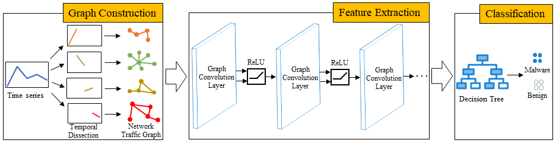

## Overview
This repository includes our works on encrypted malicious traffic detection based on graph convolutional network and temporal dissection.

The ideas behind our works can be abstracted and demonstrated in the following big picture.

## Introduction
In this work, we construct network traffic graphs based on graph convolutional network to classify nodes within the network traffic data and introduce temporal dissection to gain a more comprehensive understanding of network micro-dynamics. This work innovatively proposes a method that combines graph convolutional network and temporal dissection for the detection of encrypted malicious traffic.

## Datasets
We use the USTC-TFC2016 encrypted traffic dataset and the DataCon2020 encrypted malicious traffic dataset to evaluate the proposed method.

>  USTC-TFC2016 Datasets Specific Categories

| Category |                              Specific Category                              |
|:--------:|:---------------------------------------------------------------------------:|
|  Benign  | BitTorrent、Gmail、Skype、Facetime、MySQL、SMB、FTP、Outlook、Weibo、WorldOfWarcraft |
| Malware  |       Cridex、Miuref、Shifu、Geodo、Neris、Tinba、Htbot、Nsis-ay、Virut、Zeus        |

>  DataCon2020 Datasets Distribution

| Category | Number distribution |
|:--------:|:------:|
|  Benign  |  5000  |
| Malware  |  5000  |  

<strong><em>If you have any questions, please contact: [landaeiou@gmail.com](mailto:landaeiou@gmail.com)</em></strong>
